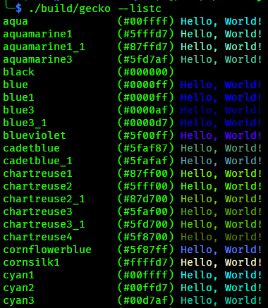
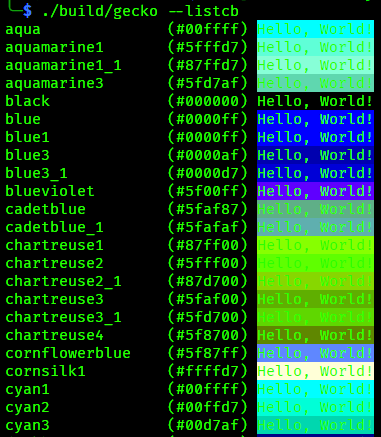
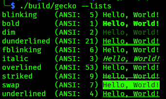
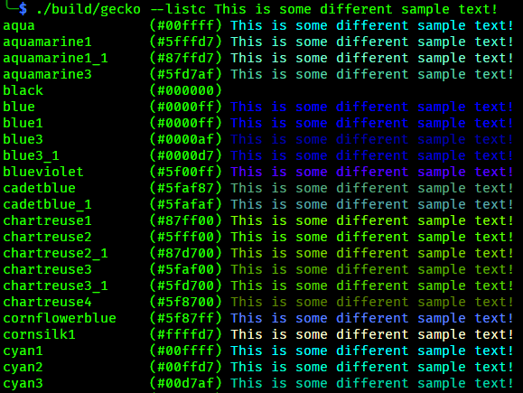

### Before you use Gecko!

This is a project I created so I could learn Go. If you need an application to help with styling text, I would ***highly*** recommend
using [gum](https://github.com/charmbracelet/gum) over Gecko. It has many more features and support.

# Gecko

A command line tool that makes it easier to style text, with great speed!

## Table of Contents
1. [Using Gecko](#using-gecko)
   1. [Styling Backgrounds](#backgrounds)
   1. [Different Colors](#different-colors)
   1. [ANSI Styles](#styles)
   1. [Escaping Markup Tags](#escaping-markup-tags)
1. [Build Instructions](#build-instructions)
   1. [Install Release Build](#releases)
   1. [Building Yourself](#building-yourself) 
1. [What's with the name?](#why-is-the-app-called-gecko-and-the-repository-called-chameleon)

## Using Gecko
To use Gecko, simply use the command with text.
```bash
$ gecko "Hello, World!"
```

But, this doesn't print with any color.
To use color, you need to add a markup tag. Like So:
```bash
$ gecko "[cyan1]This text is cyan![/]"
```
Gecko follows the same markup tagging system as [Spectre.Console](https://github.com/spectreconsole/spectre.console/tree/main). It even uses the same color names, just with a couple small differences.

Unlike [Spectre.Console](https://github.com/spectreconsole/spectre.console/tree/main), Gecko doesn't read markup tags like a stack (doesn't require a trailing `[/]` to specify the end of each color segment). You can just switch colors on the fly, and the `[/]` tag has been changed to the reset color tag. It can be used anywhere in the input string, and it will reset the console to it's default. 

A list of all colors can be found [Here](https://spectreconsole.net/appendix/colors). Or, you can use this command to get a list of
all colors:

```bash
$ gecko --listc # or --listcb to see them as background colors
```

It's recommended that you still use the `[/]` tag, at least at the end of the line to prevent runaway colors from leaking into the users prompt, or terminals next output. An even better
solution is to add `\[\033[0m\]` to the front of your `PS1` environment variable to ensure nothing can mess with the next input prompt.

> [!IMPORTANT]  
> Anything that is found to be a tag will be parsed. If the data inside cannot be mapped
> to a color or style, then the data is ignored, effectively making them weirdly placed comments.

### Backgrounds

Gecko also implements an option to color the background of text. All you need to do is add the keyword `on` after the first color in a markup tag, then the color of the background color. Like so:

```bash
$ gecko "[cyan1 on white]This should look great![/]"
```

To change only the background and leave the foreground color alone, use an underscore (`_`) then the `on` keyword with your wanted background.

```bash
$ gecko "[_ on white]Let's hope their default font color isn't white..."
```

### Different Colors
Don't like the preset colors and want to use your own? Well you can use both hex an RGB values!
Gecko will adjust the color to the best of it's ability based on what the users terminal supports. You can use them like this:

```bash
$ gecko "[#7afb42 on rgb(0,10,10)]These colors make the console look hackery[/]"
```

### Styles

Following the ANSI chart of styles (and again, [Spectre.Console](https://github.com/spectreconsole/spectre.console/tree/main)), you can use styles with colors. 
It doesn't matter what the order of the words are either, just as long as the word is known by Gecko.

An example of styles being used with Gecko:

```bash
$ gecko "[blinking red]WARNING: I HAD TO LEARN ANOTHER PROGRAMMING LANGUAGE TO MAKE THIS, PLEASE USE IT[/]"
```

Or as mentioned above, in *any order*:

```bash
$ gecko "[underlined cyan1 blinking on black]wOW, THIs Is soO COoOl![/]"
```

### And More
To get more information on Gecko, just run:
```bash
$ gecko --help
```
And you will get a list of all options to be used!

### Escaping Markup Tags

To escape a markup tag, just add a second open bracket to the start of the tag:

```bash
$ gecko "[[this isn't going to be parsed for colors :D]"
# output: [this isn't going to be parsed for colors :D]
```

# Build Instructions

## Releases

~~Go to [Releases](https://github.com/Sombody101/ChameleonTerminal/releases/) and download the most recent version.~~

Precompiled binaries will no longer be provided. The initial release will still
be available, but not up to date.

## Building Yourself

### Install the GoLang SDK

You can install the GoLang SDK from their official website using these instructions:
https://go.dev/doc/install

### Cloning The Repo

To clone the repo, run this bash command

```bash
$ git clone "https://github.com/Sombody101/ChameleonTerminal.git"
```

Once installed, navigate to `./ChameleonTerminal/` and run `make` (or `make build`).
Gecko will be built into the `build` folder.

After which, you can check the version to ensure it build correctly

```bash
$ gecko --version
```

The output should look like this:
```
vd1dffa9d9a0e7f680c4f33ff8de697dc9fcb06cf+RELEASE
ch: d1dffa9
bt: 2024-08-07T20:42:31
```

### Testing Gecko

There are a few different argument switches that show off what Gecko
can do. The most basic switch is `--listc`, or "list colors". This switch
will make Gecko run through every color it detects as supported by your terminal and prints it with sample text.



There are two other variations of this switch. `listcb` (list color background), and `lists` (list styles).




Any text supplied along with these switches will be used as the sample text instead of the default `Hello, World!`



## Why is the app called "Gecko" and the repository called "Chameleon"?

Because the original name for Gecko was "Chameleon", but I couldn't find a shorter version of that name. 
So I changed it to Gecko. It might not be a color changing animal, 
but it's better than having to type out "chameleon" every time you wanted to use the command without having to set an alias for it.


# Sponsors

Why are you looking down here?

Aww, you really thought this was good enough that someone would give me money?
That's really nice of you.
